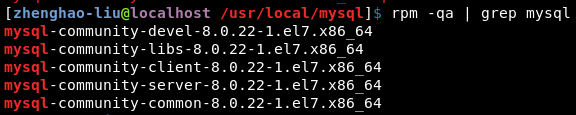
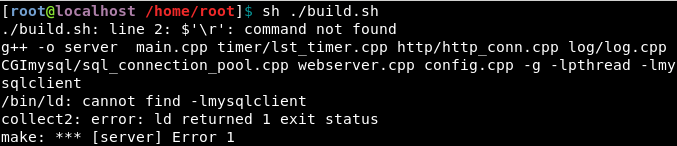
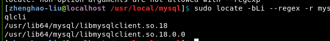
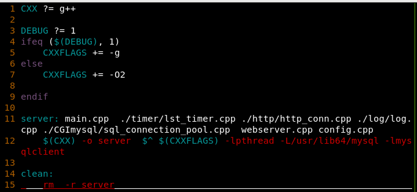

一些遇到的问题
----------

#### 1.没有对应MYSQL头文件

```
#include <mysql/mysql.h>
```
解决：安装`mysql-devel`包，可以参考[Centos下安装MYSQL](https://www.cnblogs.com/yanglang/p/10782941.html)，最后自己安装多一个包即可



#### 2.build编译提示`-lmysqlclient`找不到



解决：先定位`mysqlcli`



解决：再往`makefile`中添加对应的路径`-L路径`



#### 3.测压`webbench`程序无法运行

解决：可以尝试先删除执行文件`rm webbench`后重新编译`make`

#### 4.编译测压`webbench`失败

提示缺少`ctags`

解决 ：安装ctags即可`yum install ctags`